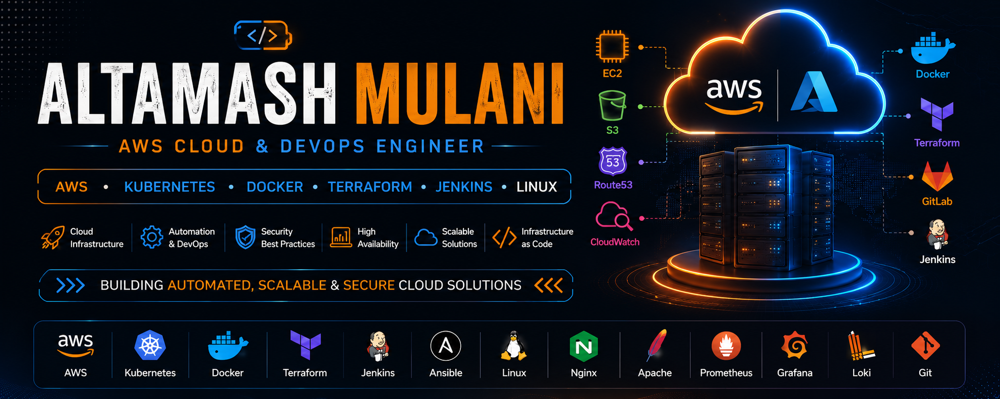

# ☁️ Altamash Mulani

### Cloud Engineer • AWS • Azure • DevOps • Linux

# 👨‍💻 About Me

I'm **Altamash Mulani**, a Cloud Engineer with **2+ years of experience** building, automating and maintaining production cloud infrastructure.

My work focuses on deploying secure, scalable and highly available infrastructure across AWS and Azure while automating repetitive operations through DevOps practices.

I enjoy solving production challenges involving Linux administration, cloud migration, disaster recovery, monitoring and infrastructure automation.

### I enjoy working on

☁ AWS Cloud Infrastructure

⚙ DevOps Automation

🐧 Linux Administration

🚀 Infrastructure as Code

📊 Monitoring & Observability

🔐 Security Hardening

🔄 Disaster Recovery

💰 Cloud Cost Optimization

# ⚡ Experience Highlights

| Achievement | Impact |
|------------|--------|
| ☁️ GitLab Migration | Migrated GitLab from Amazon Linux 2 → Rocky Linux 9 with **zero downtime** and **zero data loss**. |
| 🔄 Disaster Recovery | Executed Azure Site Recovery drills with successful production failover and failback. |
| ⚙️ Infrastructure Automation | Automated deployments, patching, backups and monitoring using Bash, reducing repetitive manual work. |
| 🐧 Linux Migration | Migrated enterprise Java applications to Rocky Linux with Apache, Nginx and Tomcat configuration. |
| 📊 Monitoring | Implemented CloudWatch, Grafana, Prometheus and Loki for centralized monitoring. |
| 🔐 Security | Performed Linux hardening, SSL implementation, auditd configuration and vulnerability remediation. |
| 💰 Cost Optimization | Contributed to AWS infrastructure optimization and resource right-sizing. |

# 🛠 Technology Dashboard

<table>

<tr>

<td width="50%" align="center">

### ☁️ Cloud

  

`EC2` `S3` `IAM` `VPC` 
`Route53` `CloudFormation` 
`Load Balancer` `Auto Scaling`

</td>

<td width="50%" align="center">

### ⚙️ DevOps

  

Docker • Terraform • Jenkins 
Ansible • GitLab

</td>

</tr>

<tr>

<td align="center">

### 🐧 Linux & Web

  

Rocky Linux • Bash • SSH • Systemd

</td>

<td align="center">

### 📊 Monitoring

  

</td>

</tr>

</table>

# 🚀 Featured Projects

<table>
<tr>

<td width="33%" valign="top">

## ☁️ GitLab Migration

Migrated GitLab from **Amazon Linux 2** to **Rocky Linux 9**.

### Highlights

- ✅ Zero Downtime
- ✅ Zero Data Loss
- ✅ Repository Migration
- ✅ CI/CD Migration
- ✅ Configuration Migration

**Tech**

`AWS` `GitLab` `Rocky Linux` `Bash`

</td>

<td width="33%" valign="top">

## 🔄 Azure Site Recovery

Performed Disaster Recovery testing using Azure Site Recovery.

### Highlights

- ✅ Production Failover
- ✅ Successful Failback
- ✅ DR Validation
- ✅ Readiness Testing

**Tech**

`Azure` `ASR` `Linux`

</td>

<td width="33%" valign="top">

## 🐧 Linux Migration

Migrated enterprise applications to Rocky Linux.

### Highlights

- ✅ Java Installation
- ✅ Apache
- ✅ Nginx
- ✅ Tomcat
- ✅ Application Deployment

**Tech**

`Rocky Linux` `Java` `Tomcat`

</td>

</tr>
</table>

---

<table>
<tr>

<td width="33%">

## ⚙️ Infrastructure Automation

Automated repetitive infrastructure operations.

### Highlights

- Server Health Checks
- Backup Scripts
- Log Rotation
- Deployment Scripts
- Cron Automation

**Tech**

`Bash`

`Linux`

`Automation`

</td>

<td width="33%">

## 📊 Cloud Monitoring

Built centralized monitoring.

### Stack

- CloudWatch
- Grafana
- Prometheus
- Loki

**Focus**

Infrastructure Visibility

Performance Monitoring

Log Aggregation

</td>

<td width="33%">

## 🔐 Security Hardening

Improved infrastructure security.

### Work

- SSL
- auditd
- Linux Hardening
- Vulnerability Remediation

**Focus**

Security Best Practices

</td>

</tr>
</table>

# 🏆 Certifications

# 📈 GitHub Dashboard

 

 

 

# 🐍 Contribution Snake

# 📚 Currently Learning

<table>

<tr>

<td>

☸ Kubernetes

</td>

<td>

⚡ GitHub Actions

</td>

<td>

🚀 Advanced Terraform

</td>

</tr>

<tr>

<td>

📦 Docker Best Practices

</td>

<td>

🏗 Platform Engineering

</td>

<td>

🔍 Observability

</td>

</tr>

</table>

# 🤝 Connect With Me

---

## 💭 Quote

> **"Automate everything possible. Build reliable infrastructure. Keep learning."**

⭐ Thanks for visiting my profile!

